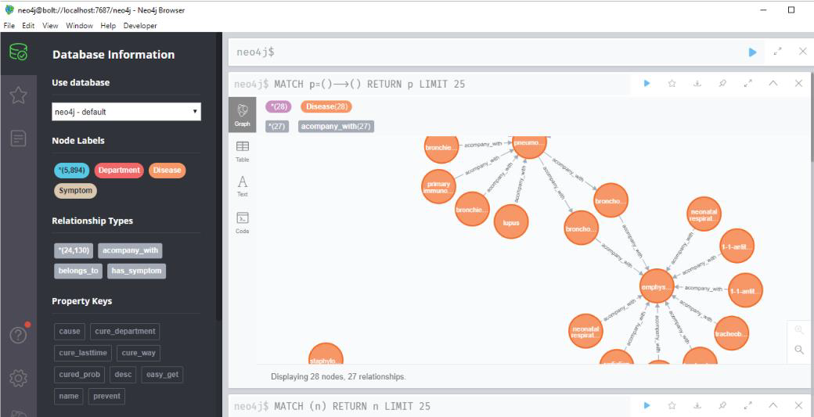
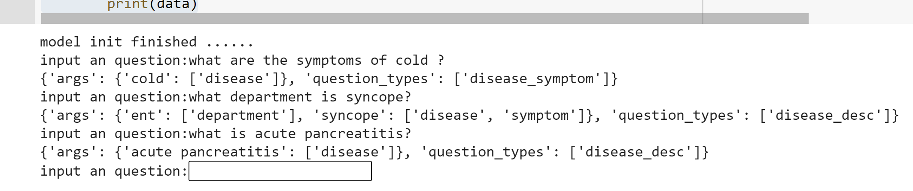
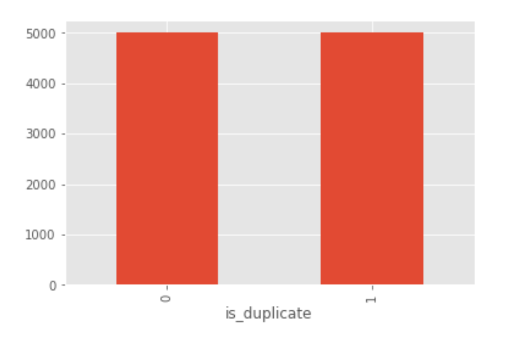
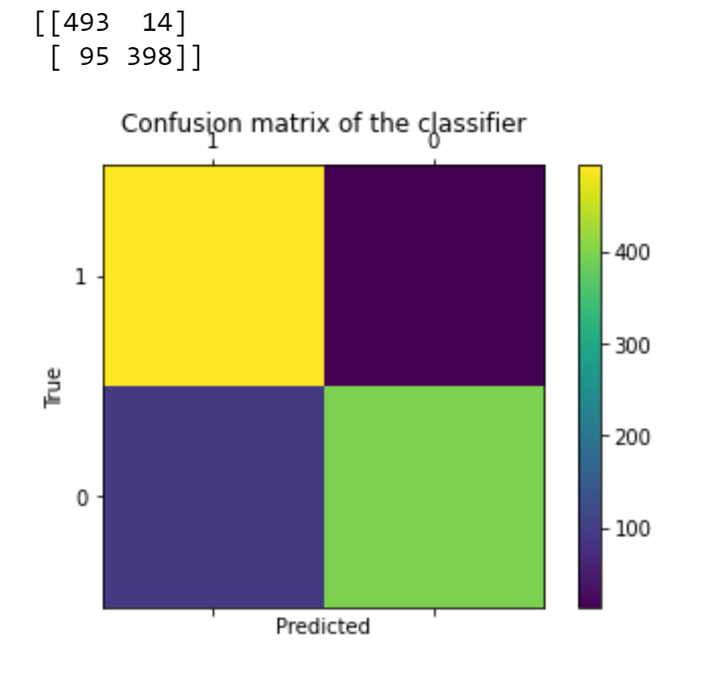
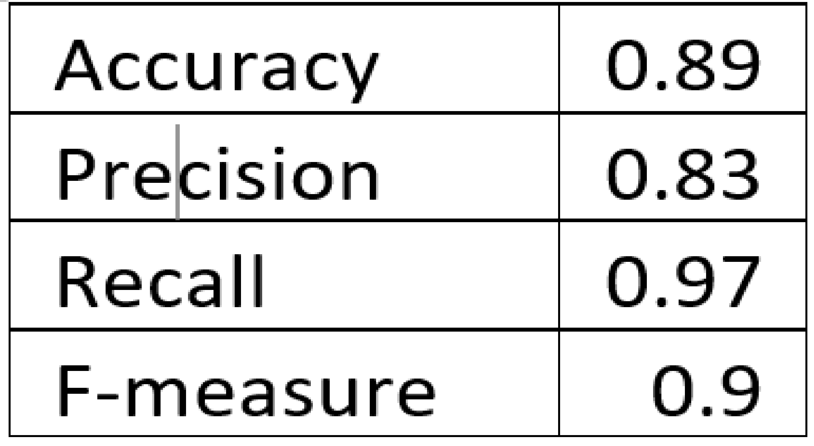

# Healthcare-Helper-system-using-Knowledge-graph-and-BERT

## Abstract:

This project is about creating and coding a question answering system based on a neural network. A framework which consists of a knowledge graph and a text similarity model, Bidirectional Encoder Representations from Transformers (BERT). The knowledge graph is developed by Neo4j with data from the Health Navigator New Zealand, common illnesses and symptom and common diseases and conditions. A Google’s language model called BERT is used which shows that a language model which is bidirectionally trained can have a deep sense of language context and flow. A PyTorch code for question answering with BERT fine-tuned is used. The model showed good results; precision, recall and f-score of 0.8, 0.97, 0.9 respectively. 

## Flow of the code:

1) Knowledge Graph folder: 

First install the neo4j software, create a database and keep it active. Make neccessary chnages in 'neo4j.ipynb' file and run. Use the csv file "medical_knowledge_base.csv" in the code. The 3 files (disease, symptoms, department) are generated. Then run the "question_classifier.ipynb"

2)BERT

Import the train file and run the "BERT_FinalCode.ipynb" file to train the model and to get the confusion matrix and results.

## Methodology:

## 1) Knowledge graph 
Knowledge graph  is a structured collection of information. It stores facts in the form of relations between different entities. These entities and relations are referred to as the Knowledge that is extracted and organized in graph structures. The entities are represented as nodes and relations as edges in the graph structure. In Natural Language Processing (NLP), extraction of entities and relations from text is an important task that is done using a technique called Dependency parsing. Parsing is the task of identifying syntactic relationships of words within a sentence given the grammar rules of a language. One way to accomplish this task by linking individual words together based on their dependency relationship. This is called dependency grammar parsing as it maps a sentence to a dependency parse tree. Nodes and edges that are in between are the most crucial things to consider when building a Knowledge graph. Lots of text data can be used to identify the entity pairs and relationships. To extract insights from text data, this knowledge graph will be put to use.

### Data acquisition and data exploration

The knowledge graph is developed by Neo4j with data from the Health Navigator New Zealand. The QA pair dataset is generated in 2017, originally from eHealth Forum, Question Doctors and WebMD. 

The system knowledge graph which contains:

•	3 entities: department, disease, and symptom

•	6 properties: name, description, cause, prevent, cause, cure_way, cure_department, cured_prob

•	3 relationships: has_symptom, accompany_with, belongs_to

There are about 3,500 entities (which include 675 diseases and 2,825 symptoms) and 4,500 relationships. The relationship includes the relationship between the diseases, symptoms, and the other 6 properties. The below results are obtained after running a python code. The python code is written using the libraries; py2neo, pandas and json. The results can be seen in the “neo4j for desktop” tool. Neo4j is a native graph database, built from the ground up to leverage not only data but also data relationships.

The files generated from this are: department, disease and symptoms. Using these files, question classifier is created using the AhoCorasick algorithm where function extracts the disease keywords from a medical keywords dictionary. The code is called Question_classifier. The imput and output for the code is shown below. 
  

It identifies the disease and symptom entities in the given question, it will enter the semantic similarity calculation module, and search for the most similar k entities in semantics. Using this further, questions can be parsed and a chatbot can be built. Now we will see how this can be applied using BERT. 

## 2) BERT
Bidirectional Encoder Representation from Transformers makes use of a new technique called Masked LM (MLM) where words in a sentence are randomly masked by the model and then it tries to predict them. BERT model trains in both direction as the name implies and uses the full context of the sentence from both directions to predict the masked words. BERT is based on the transformer architecture which is the self-attention mechanism that learns contextual relationship between words in text. But unlike transformers which uses encoder-decoder network, BERT contains only encoder. We first randomly mask the words in an input and then run the entire sequence through BERT attention-based encoder which will predict only the masked words based on the context provided by the other words which were not masked. 512 tokens are the maximum sequence length of the input. BERT can be applied directly in sentence classification by applying a classification layer on top of the transformer. 

### Data acquisition and data exploration
The data set has pairs of questions organized in the form of 6 columns as explained:
•	id: Row ID
•	qid 1, qid 2: The unique ID of each question in the pair
•	Question 1, question 2: The actual textual contents of the questions.
•	is_duplicate: Label is 0 for questions which are semantically different and 1 for questions which essentially would have only one answer (duplicate questions).

## Results

